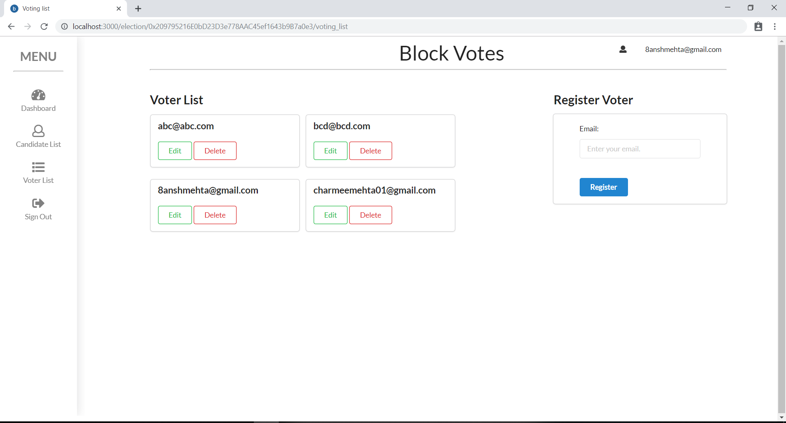

# Project Name: Blockchain Voting System

## Introduction
The Blockchain Voting System is a decentralized voting platform that leverages blockchain technology to ensure secure, transparent, and tamper-resistant elections. This project was born out of the desire to address the inherent challenges and vulnerabilities in traditional voting systems. We aimed to create a solution that promotes trust, transparency, and inclusivity in the electoral process.



<!-- Deployed Site: [Blockchain Voting System](https://www.blockchainvotingsystem.com)
 -->
<!-- Final Project Blog Article: [Read our blog post](https://www.blockchainvotingsystem.com/blog)
 -->
Author(s):
- David Langat: [LinkedIn](https://www.linkedin.com/in/davidlangat)

## Inspiration and Technical Challenge
Our inspiration for creating the Blockchain Voting System stemmed from a deep-rooted belief in the importance of fair and transparent elections. We recognized the need for a solution that could overcome the challenges posed by traditional voting systems, such as voter fraud, data manipulation, and lack of transparency.

The technical challenge we set out to solve was to design a decentralized voting platform that could ensure the integrity and security of the electoral process. We aimed to leverage blockchain technology to create an immutable and transparent ledger of votes, eliminating the need for a centralized authority and minimizing the potential for tampering or manipulation.

## Implementation Details
The Blockchain Voting System is built using React.js, a popular JavaScript framework for building user interfaces. React.js allowed us to create a dynamic and responsive application, providing a seamless user experience.

We employed the following key components and algorithms in the implementation of the system:

1. **Blockchain:** We utilized a blockchain data structure to store the votes securely. Each vote is represented as a block containing the voter's information and encrypted vote details. The blocks are linked together through cryptographic hashes, creating an immutable and tamper-resistant chain of votes.

2. **Smart Contracts:** To facilitate the execution of the voting process and enforce the rules, we implemented smart contracts using Ethereum's Solidity programming language. These contracts govern the registration of voters, validation of votes, and overall management of the election.

3. **Encryption:** To ensure voter privacy and data security, we incorporated encryption techniques to protect sensitive information. Each vote is encrypted using advanced cryptographic algorithms, making it practically impossible to decipher without the proper decryption key.

## Installation
To install and set up the Blockchain Voting System locally, please follow these steps:

1. Clone the repository:
   ```bash
   git clone https://github.com/your-username/blockchain-voting-system.git
   ```

2. Navigate to the project directory:
   ```bash
   cd blockchain-voting-system
   ```

3. Install the dependencies:
   ```bash
   npm install
   ```

4. Configure the environment variables:
   - Rename the `.env.example` file to `.env`.
   - Update the values in the `.env` file with your desired configuration.

5. Start the application:
   ```bash
   npm start
   ```

6. Access the Blockchain Voting System locally by visiting `http://localhost:3000` in your web browser.

## Usage
The Blockchain Voting System provides a user-friendly interface for voters, administrators, and election observers. It allows users to perform the following actions:

- **Voters:**
  - Register to vote securely.
  - Cast their vote anonymously.
  - Verify their vote after it has been recorded on the blockchain.

- **Administrators:**
  - Create and manage elections.
  - Add and remove eligible voters.
  - Monitor and analyze voting statistics.

- **Election Observers:**
  - Monitor the election process for transparency.
 

 - Verify the integrity of the recorded votes.

To get started, follow the installation instructions and navigate to the deployed site or the local instance of the application.

## Challenges Faced
Throughout the development process, we encountered several challenges that tested our problem-solving abilities and pushed us to learn and grow. Some of the key challenges include:

- **Usability and Accessibility:** Ensuring that the application was intuitive and accessible to a diverse range of users was a significant challenge. We invested considerable effort in creating a user-friendly interface that accommodates users with varying levels of technical expertise.

- **Security and Privacy:** Implementing robust security measures to protect voter privacy and prevent tampering was a complex task. We conducted thorough testing and implemented encryption techniques to mitigate potential vulnerabilities.

- **Scaling and Performance:** Designing the system to handle a large number of concurrent voters and ensuring optimal performance was a crucial consideration. We optimized the code and utilized efficient data structures to achieve scalability and responsiveness.

## Next Iteration and Future Enhancements
While we are proud of the accomplishments and progress made in developing the Blockchain Voting System, we acknowledge that there is still room for improvement. In the next iteration, we envision incorporating the following enhancements:

- **Integration with Digital Identity Solutions:** Integrate with existing digital identity solutions to streamline the voter registration process and further enhance security.

- **Improved User Interface:** Enhance the user interface to provide a more intuitive and visually appealing experience, making it accessible to a wider range of users.

- **Integration of Additional Blockchain Technologies:** Explore the integration of other blockchain platforms, such as Hyperledger Fabric or Corda, to offer more options and cater to different use cases.

- **Enhanced Security Auditing:** Conduct regular security audits and penetration testing to identify and address potential vulnerabilities and further strengthen the system's security measures.


## Licensing
The Blockchain Voting System is open-source software licensed under the [MIT License](https://opensource.org/licenses/MIT).

---
